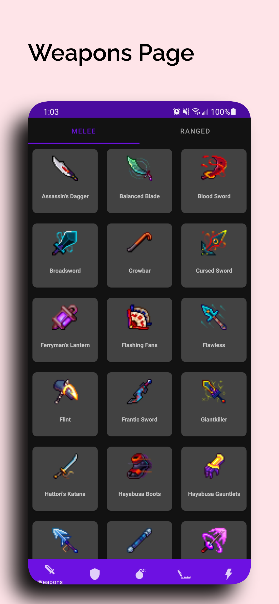

# Dead Cells Reference

Dead Cells Reference provides information about the items found in the Dead Cells video game. This
includes where to find the items and their stats.

Pretty screenshots generated using [app-mockup](https://app-mockup.com/)

## Info

The data about the items and their stats are sourced from the
[Dead Cells Wiki Gear Page](https://deadcells.fandom.com/wiki/Gear). A web scraper scrapes the
information from the page and updates a Firestore.

The Wiki is created by the community, so I have the diffs emailed to me to approve/deny the changes.

The scraper checks for updates each morning at 11am PST.

The app talks to a Firestore database containing the item data.
